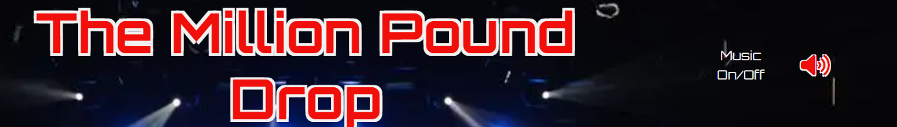
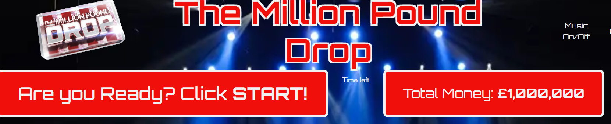
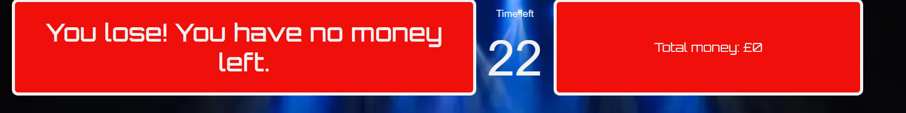
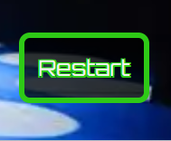
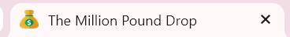
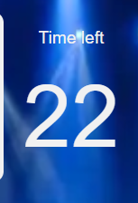
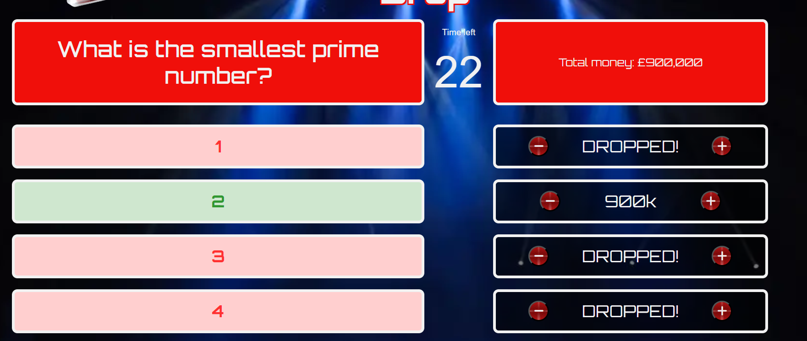
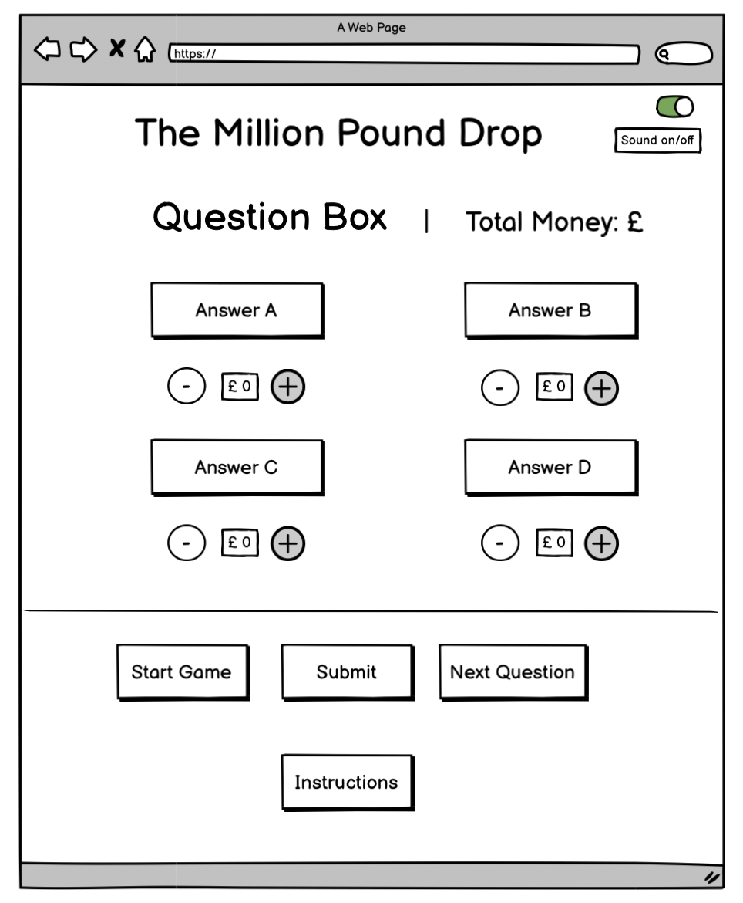
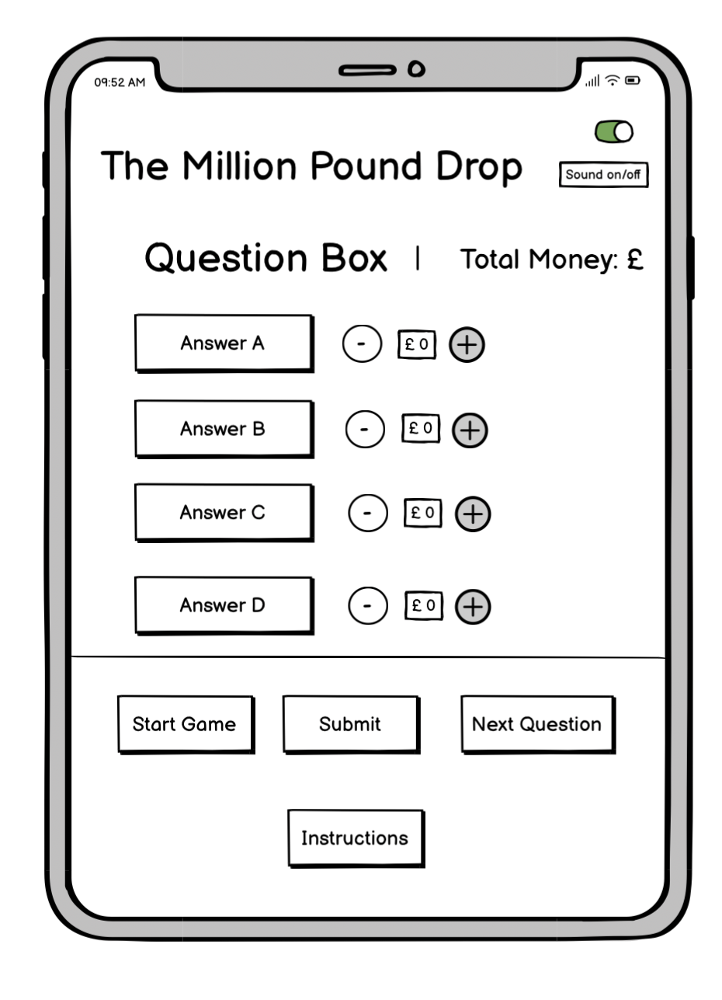

# The Million Pound Drop

For the Code Institute Bootcamp Hackathon #2, our team decided to complete the quiz project. We were inspired by the popular game show 'The Million Pound Drop'.

## Features

### User stories

###### Sitewide
As a user, I want the quiz to be mobile-responsive, so that I can play the game on tablet and mobile devices.
 
✅ All Pages are fully functional on mobile and tablet devices.

###### Homepage
As a user, I want to see a visually pleasing page which is easy to read and understand.

✅ Visually pleasing homepage.

As a user, I would like to be able to mute the music and sound effects.

✅ Music toggle to mute.

As a user, I would like clear instructions on how to play Million Pound Drop.

✅ Instructions pop up.

As a user, I would like to be able to see my current money total.

✅ Current money total box.

As a user, I would like to know if i lose all my money and the game ends.

✅ You Lose alert.

As a user, I would like to be able to restart the game once I lose.

✅ Restart button.

As the developer, I would like browser icon next to my page title.

✅ Favicon in browser.

As the developer, I would like to have a countdown timer to add tension to the game.

✅ 30 second countdown timer.

As the developer, I would like the questions to increase in difficulty.

As the developer, I would like the the correct answer to flash green and wrong answers red.

✅ Color flash to designate correct and incorrect answers.

## Wireframes 

Desktop

Mobile

