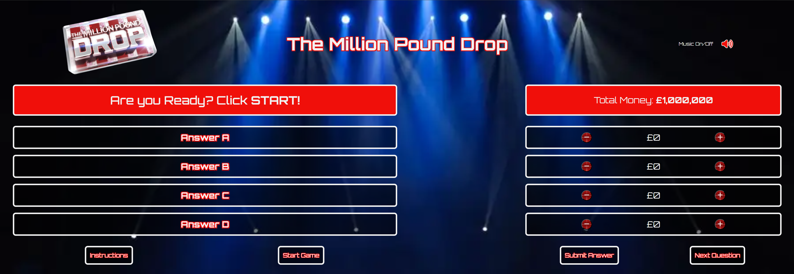
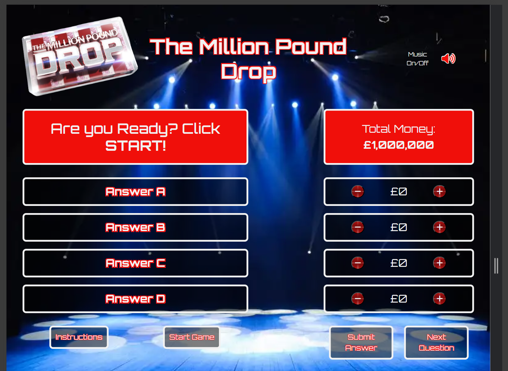
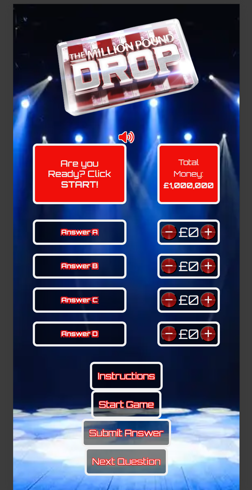

# The Million Pound Drop

For the Code Institute Bootcamp Hackathon #2, our team decided to complete the quiz project. We were inspired by the popular game show 'The Million Pound Drop'.

## Features

### User stories

###### Sitewide
As a user, I want the quiz to be mobile-responsive, so that I can play the game on tablet and mobile devices.
 
✅ All Pages are fully functional on mobile and tablet devices.

###### Homepage
As a user, I want to see a visually pleasing page which is easy to read and understand.

✅ Visually pleasing homepage.

######